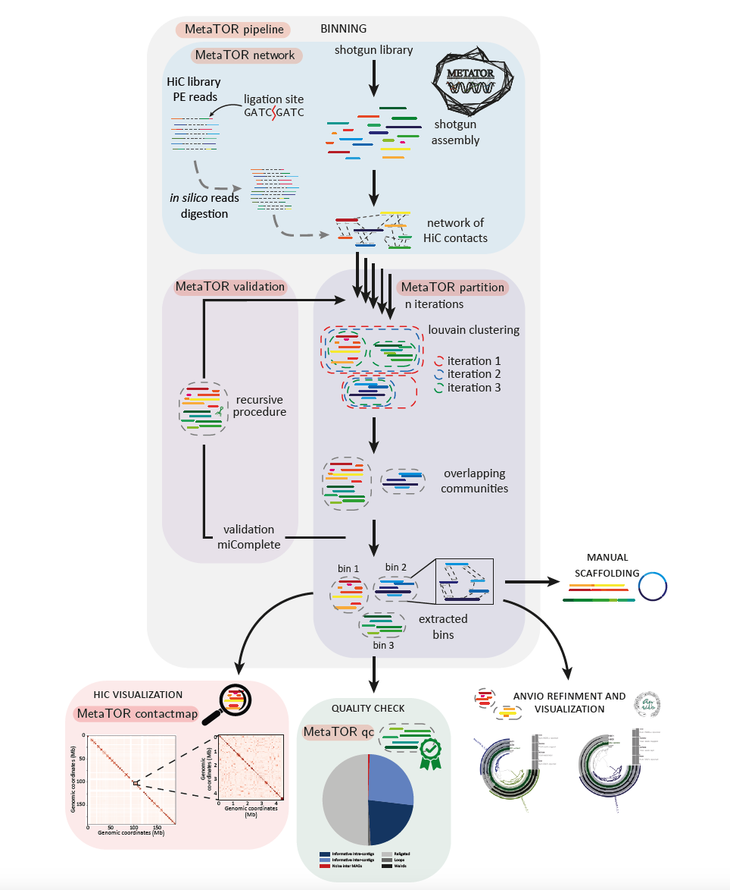

# Tuto_MetaTOR

For this session we will learn how to use 3C/Hi-C data and MetaTOR to perform the binning of a simple metagenome. The data come from a mock community designed at the lab.

## Table of contents

* [MetaTOR](#MetaTOR)
* [Dataset](#Dataset)
* [Usage](#Usage)
* [End-to-End pipeline](#End-to-End-pipeline)
* [Output files](#Output-files)
* [3D Analysis](#3D-Analysis)
* [References](#References)
* [Contact](#Contact)

## MetaTOR

Metagenomic Tridimensional Organisation-based Reassembly

<p align="center">
  
</p>

if you want more described doc of MetaTOR and the different possibilities offered by the pipeline , various tutorials are available at the following links:

* package is available [here](https://github.com/koszullab/metaTOR)
* A tutorial is available [here](docs/example/metator_tutorial.md) to explain how to use metaTOR. 
* [Anvio](https://merenlab.org/software/anvio/) manual curation of the contaminated bins. Available [here](docs/example/manual_curation_of_metator_MAGs.md).
* Visualization and scaffolding of the MAGs with the contactmap modules of MetaTOR. Available [here](docs/example/MAG_visualization_and_scaffolding.md).

Principle of MetaTOR pipeline:



## Dataset

In this analysis, we will use a simple metagenomic dataset with a defined community. It will allow us to perform some tests without too much computationnal time.

the different data for the tutorial can be found here : [/ifb/data/public/teachdata/ebame-2022/metator/]

The folder contain the FastQ files correzsponding to the Hi-C library of the mock community, the FastA files of the assembly and others folder we will use later.

```sh
ls -l /ifb/data/public/teachdata/ebame-2022/metator/
```

the assembly can be found here : [/ifb/data/public/teachdata/ebame-2022/metator/FastA/]

```sh
ls -l /ifb/data/public/teachdata/ebame-2022/metator/FastA/
```

Here the assembly has been made using ShotGun sequences (PE Illumina sequencing: 2x75bp, NextSeq500). Before building the assembly reads were filtered and trimmed using Cutadapt (v1.9.1). Here the assembly have been build using Megahit (v1.1.1.2) with default paramters.

in order to perform the binning based on 3D contact, we also need 3C dataset from the same sample.

FastQ Hi-C PE reads can be found here : [/ifb/data/public/teachdata/ebame-2022/metator/FastQ/]

```sh
ls -l /ifb/data/public/teachdata/ebame-2022/metator/FastQ/
```

First of all, you will need to provide the PATH (absolute PATH !!) to the clustering algorithm. In our case we will use the louvain algorithm.

```sh
export LOUVAIN_PATH=/ifb/data/public/teachdata/ebame-2022/metator/scripts/gen-louvain/
```

## Usage

MetaTOR is a modular pipeline allowing to perform each step separetly or in an end to end pipeline

```sh
metator --help
```

A metaTOR command takes the form `metator action --param1 arg1 --param2
arg2 #etc.`

There are three actions/steps in the metaTOR pipeline, which must be run in the
following order:

* `network` : Generate metaHiC contigs network from fastq reads or bam files and normalize it.
* `partition` : Perform the Louvain or Leiden community detection algorithm many times to bin contigs according to the metaHiC signal between contigs.

* `validation` : Use CheckM to validate the bins, then do a recursive decontamination step to remove contamination.

There are a number of other, optional, miscellaneous actions:

* `pipeline` : Run all three of the above actions sequentially or only some of them depending on the arguments given. This can take a while.
* `contactmap` : Generates a contact map from one bin from the final ouptut of metaTOR.

* `version` : display current version number.

* `help` : display help message.

## End-to-End pipeline

using the provided dataset, you can launch the whole pipeline. You will skeep the validation step as checkM is a very consuming software (40 Go RAM) unable to run on your VM.

```sh
metator pipeline --help
```

this commands will take approximately 10 min

```sh
metator pipeline -v -F -i 10 -a /ifb/data/public/teachdata/ebame-2022/metator/FastA/mock_ass_tot.fa -1 /ifb/data/public/teachdata/ebame-2022/metator/FastQ/lib_3C_for.fastq.gz -2 /ifb/data/public/teachdata/ebame-2022/metator/FastQ/lib_3C_rev.fastq.gz -o test_MetaTOR/
```

MetaTOR will provide you with various metrics about the whole pipeline. It will also generate different files necessary for downstream analysis. You will also find a log file in the output directory containning the different informations.

```sh
ls -l test_MetaTOR/
```

you can restart the pipeline by varying the number of iterations of the louvain algorithm (from 1 to 20 for instance) and observe how the number of MAGs evolve depending on the number of iterations. Be carefull to provide a different output directory.


## Output files

As we have launch the pileine without the checkM validation, the output files are not complete. MetaTOR use checkM to validate MAGs and to select MAGs that need to be cleaned through a recursive process of the algorithm. Indeed, in very large network (which is not the case here), the algorithm suffer from resolution limits and need sometimes to be re-run on sub-network.

You will find the complete output files at the following path:

```sh
ls -l /ifb/data/public/teachdata/ebame-2022/metator/output_MetaTOR/
```

you can explore the different files. MetaTOR also generates different plot / image file concerning the MAGs obtained and the binning of the assembly.

## 3D Analysis

3C data and MetaTOR also allow to generate contact matrices of various genomic object (contigs, bin, MAG, overlapping MAGs).

the command follow the following rules:

```sh
metator contactmap --help
```

now, we can generate one contactmap file

```sh
metator contactmap -a /ifb/data/public/teachdata/ebame-2022/metator/FastA/mock_ass_tot.fa -c /ifb/data/public/teachdata/ebame-2022/metator/output_MetaTOR/contig_data_final.txt -n "NODE_1904_length_66902_cov_0" -o contact_map_1/ -O contig --pairs /ifb/data/public/teachdata/ebame-2022/metator/output_MetaTOR/alignment_0.pairs -F -f -e HinfI,DpnII
```

by re-using the command, generate a contact map of the most covered or longest contig, the most covered or largest MAG .. etc .. (all the data you need are present in the repertory with the different output files {/opt/metagenomics/tp3/Tuto_MetaTOR_output/}). Be carefull to change the name of the output directory !!!!

WARNING !!!   the command only generates the contact map files but not the pdf files. To generate an image file, we will use hicstuff and several command lines:

hicstuff have many commands and options

```sh
hicstuff --help 
```

one command allow to reconstruct contact map (i.e. matrices) with a fixed bin size in kilobase (kb)

```sh
hicstuff rebin --help 
```

 here is example of a command line to rebin a contactmap to 10kb

```sh
hicstuff rebin -f contact_map_1/fragments_list.txt -c contact_map_1/info_contigs.txt -b 10kb contact_map_1/abs_fragments_contacts_weighted.txt contact_map_1/map_10Kb
```

you can now generate the image file using a script located here: /opt/metagenomics/tp3/

the script take 4 arguments : 1-the matrix 2-the rebin factor 3-the raw image file 4-the normalized image file

NB: the second argument is a binning factor. If you put 1 you will obtain the same binning as previously set with hicstuff rebin.

```sh
python3.8  scripts/sparse_mat.py contact_map_1/map_10Kb.mat.tsv 1 contact_map_1/map_10Kb_raw.pdf contact_map_1/map_10Kb_norm.pdf 
```

you can now generate the different image files of your different matrices (the largest contig, a MAG ... etc). Be carefull with the binning size and factor when trying to generate matrix for MAGs !!! computation could be time consuming for large MAG with high resolution (few kb). 

if you want to go further ,i have provided various matrix (community, bacteria) at high resolution in the folder [/data_matrices/]. You can have a look and generate some contact matrices. Be carefull with the mock community data as the matrix is quite big.


## References

* [Metagenomic chromosome conformation capture (meta3C) unveils the diversity of chromosome organization in microorganisms](https://www.ncbi.nlm.nih.gov/pmc/articles/PMC4381813/), Martial Marbouty, Axel Cournac, Jean-François Flot, Hervé Marie-Nelly, Julien Mozziconacci, and Romain Koszul, eLife, 2014
* [Meta3C analysis of a mouse gut microbiome](https://www.biorxiv.org/content/early/2015/12/17/034793), Martial Marbouty, Lyam Baudry, Axel Cournac, Romain Koszul, 2015
* [Scaffolding bacterial genomes and probing host-virus interactions in gut microbiome by proximity ligation (chromosome capture) assay](https://www.ncbi.nlm.nih.gov/pmc/articles/PMC5315449/), Martial Marbouty, Lyam Baudry, Axel Cournac, and Romain Koszul, Science Advances, 2017

## Contact

### Authors

* amaury.bignaud@pasteur.fr
* martial.marbouty@pasteur.fr
* romain.koszul@pasteur.fr

### Research lab

[Spatial Regulation of Genomes](https://research.pasteur.fr/en/team/spatial-regulation-of-genomes/) (Institut Pasteur, Paris)
