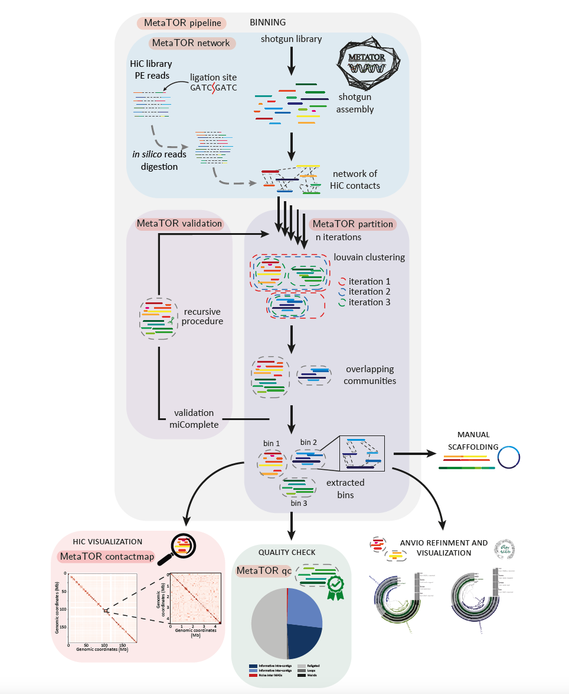
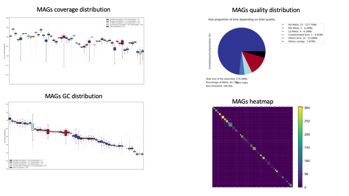

# Tuto_MetaTOR

For this session we will learn how to use 3C/Hi-C data and MetaTOR to perform the binning of a simple metagenome. The data come from a mock community designed at the lab.

## Table of contents

* [MetaTOR](#MetaTOR)
* [Dataset](#Dataset)
* [Machine_Configuration](#Config)
* [Usage](#Usage)
* [End-to-End pipeline](#End-to-End-pipeline)
* [Output files](#Output-files)
* [3D Analysis](#3D-Analysis)
* [References](#References)
* [Contact](#Contact)

## MetaTOR

Metagenomic Tridimensional Organisation-based Reassembly

<p align="center">
  
</p>

if you want more described doc of MetaTOR and the different possibilities offered by the pipeline , various tutorials are available at the following links:

* package is available [here](https://github.com/koszullab/metaTOR)
* A tutorial is available [here](docs/example/metator_tutorial.md) to explain how to use metaTOR. 
* [Anvio](https://merenlab.org/software/anvio/) manual curation of the contaminated bins. Available [here](docs/example/manual_curation_of_metator_MAGs.md).
* Visualization and scaffolding of the MAGs with the contactmap modules of MetaTOR. Available [here](docs/example/MAG_visualization_and_scaffolding.md).

Principle of MetaTOR pipeline:



## Dataset

In this analysis, we will use a simple metagenomic dataset with a defined community. It will allow us to perform some tests without too much computationnal time.

the different data for the tutorial need to be copied on your VM from the public space:

option 1 - data are available on the public partition storage of your VM

```sh
cp -r /ifb/data/public/teachdata/ebame-2024/Tuto_MetaTOR.tar.gz ./
```

option 2 - data can be downloaded here (longer)

```sh
wget "https://filesender.renater.fr/?s=download&token=1ed92571-9731-4c01-878b-2bdfc2d36735](https://filesender.renater.fr/?s=download&token=54b6e76b-3295-47dd-b081-3183b16bd1a5" -O MetaTOR
```
 and they also need to be decompressed

 ```sh
cd MetaTOR
tar -xvf Tuto_MetaTOR.tar.gz
```


The folder contain the FastQ files correzsponding to the Hi-C library of the mock community, the FastA files of the assembly and others folder we will use later.

```sh
ls -l Tuto_MetaTOR/
```

the assembly can be found here : [Tuto_MetaTOR/assembly]

```sh
ls -l Tuto_MetaTOR/assembly/
```

Here the assembly has been made using ShotGun sequences (PE Illumina sequencing: 2x75bp, NextSeq500). Before building the assembly reads were filtered and trimmed using Cutadapt (v1.9.1). The assembly has been then obtained using Megahit (v1.1.1.2) with default paramters.

in order to perform the binning based on 3D contact, we also need 3C dataset from the same sample.

FastQ Hi-C PE reads can be found here (small part of the whole dataset): [Tuto_MetaTOR_2023/FastQ/]

```sh
ls -l Tuto_MetaTOR/FastQ/
```

## Config

First of all, we have to activate the environment in conda

```sh
conda activate metator
```

than, you will need to provide the PATH to the clustering algorithm. In our case we will use the louvain algorithm.

```sh
export LOUVAIN_PATH=Tuto_MetaTOR/gen-louvain/
```

## Usage

MetaTOR is a modular pipeline allowing to perform each step separetly or in an end to end pipeline

```sh
metator --help
```

A metaTOR command takes the form `metator action --param1 arg1 --param2
arg2 #etc.`

There are three actions/steps in the metaTOR pipeline, which must be run in the
following order:

* `network` : Generate metaHiC contigs network from fastq reads or bam files and normalize it.
* `partition` : Perform the Louvain or Leiden community detection algorithm many times to bin contigs according to the metaHiC signal between contigs.

* `validation` : Use CheckM to validate the bins, then do a recursive decontamination step to remove contamination.

There is also a option to run the wole pipeline (end-to-end):

* `pipeline` : Run all three of the above actions sequentially or only some of them depending on the arguments given. This can take a while.

There are a number of other, optional, miscellaneous actions:

* `qc` : Generates some quality check on the output of metator.
* `contactmap` : Generates a contact map from one bin from the final ouptut of metaTOR.
* `scaffold` : try to scaffold a well covered bin from the final ouptut of metaTOR.
* `pairs` : Sort the pairs file using pairtools. Compress them using bgzip. Index them using pairix.

* `version` : display current version number.

* `help` : display help message.

## End-to-End pipeline

using the provided dataset, you can launch the whole pipeline.

```sh
metator pipeline --help
```

this commands will take some time (30 min) due to the small configuration of your VM...

```sh
metator pipeline -v -F -i 10 -a Tuto_MetaTOR/assembly/assembly_mock.fa -1 Tuto_MetaTOR/FastQ/Lib_3C_R1.fq.gz -2 Tuto_MetaTOR/FastQ/Lib_3C_R2.fq.gz -o Tuto_MetaTOR/out_MetaTOR/
```

NB: The option [-F] is mandatory if the putput directory already exist.


MetaTOR will provide you with various metrics about the whole pipeline. It will also generate different files necessary for downstream analysis. You will find the complete output in the [metator] folder..

```sh
ls -l Tuto_MetaTOR/out_MetaTOR/
```

you will find info about the contigs and their binning, here:

```sh
cat Tuto_MetaTOR/out_MetaTOR/contig_data_final.txt | head
```

but also about the MAGs, here:

```sh
cat Tuto_MetaTOR/out_MetaTOR/bin_summary.txt | head
```

NB: the file [binning.txt] allow to use it in ANVIO to clean the MAGs or to have visualization.


you will also find a log file in the output directory containning the different informations of the whole process.

```sh
cat Tuto_MetaTOR/out_MetaTOR/metator_XXXXX.log
```

you can explore the different files. MetaTOR also generates different plot / image file concerning the MAGs obtained and the binning of the assembly.



MetaTOR allow to restart command at different points of the pipeline. It is possible to redo a faster pipeline by using BAM files or PAIRS files as starting points. You can restart the pipeline with a different number of iterations of the louvain algorithm. Here we will restart the pipeline at the PAIRS level.


```sh
metator pipeline -v -F -i 10 --start pair -1 Tuto_MetaTOR/out_MetaTOR/alignment_0_sorted.pairs.gz -a Tuto_MetaTOR/assembly/assembly_mock.fa -o Tuto_MetaTOR/out_MetaTOR_2/
```

We can also make different number of iterations of the louvain algorithm in order to see the variations in the provided output.

```sh
for it in $(seq 1 2 9)
do
echo "number of iterations:""$it"
metator pipeline -v -F -i "$it" --start pair -1 Tuto_MetaTOR/out_MetaTOR/alignment_0_sorted.pairs.gz -a Tuto_MetaTOR/assembly/assembly_mock.fa -o Tuto_MetaTOR/out_MetaTOR_it"$it"/
echo "FINITO"
echo ""
done
```


## Output files

MetaTOR use the software miComplete to validate MAGs and to select MAGs that need to be cleaned through a recursive process of the algorithm. Indeed, in very large network (which is not the case here), the algorithm suffer from resolution limits and need sometimes to be re-run on sub-network. The software is a bit less precise than CheckM but is really faster and less memory consuming. Generally, at the end of the pipeline, we use CheckM or GTDB-tk to assess properly the quality of the retrieved MAGs and annotate them.

You will find the complete output files obtained using the whole dataset (around 90 Millions of PE reads) at the following path:

```sh
ls -l Tuto_MetaTOR/metator_final/
```

## Mobile genetic elements binning

metator also allow to bin MGE based on their contact. the module can be called like that 

```sh
metator mge --help
```

the first step is to select the contigs you want to target and to generate a fasta files with these contigs. You will find in the directory [Tuto_MetaTOR/data/mock_genomad/] the output of geNomad on the mock community assembly.

```sh
mkdir Tuto_MetaTOR/metamge/
cat Tuto_MetaTOR/data/mock_genomad/mock_plasmid_summary.tsv| sed '1d' | awk '{print $1}' > Tuto_MetaTOR/metamge/target_mge.txt
cat Tuto_MetaTOR/data/mock_genomad/mock_virus_summary.tsv| sed '1d' | awk '{print $1}' >> Tuto_MetaTOR/metamge/target_mge.txt
cat Tuto_MetaTOR/data/mock_genomad/mock_plasmid.fna Tuto_MetaTOR/data/mock_genomad/mock_virus.fna > Tuto_MetaTOR/metamge/target_mge.fa
```

then can launch the module

```sh
metator mge --network Tuto_MetaTOR/metator_final/network.txt --fasta Tuto_MetaTOR/metamge/target_mge.fa --mges Tuto_MetaTOR/metamge/target_mge.txt --plot --binning Tuto_MetaTOR/metator_final/binning.txt --outdir Tuto_MetaTOR/metamge/ --threads --contigs-data Tuto_MetaTOR/metator_final/contig_data_final.txt
```

## 3D Analysis

3C data and MetaTOR (by it connection with our software hicstuff) also allow to generate contact matrices of various genomic object (contigs, bin, MAG, overlapping MAGs).

the command follow the following rules:

```sh
metator contactmap --help
```

now, we can generate one contactmap file

```sh
metator contactmap -a Tuto_MetaTOR/assembly/assembly_mock.fa -c Tuto_MetaTOR/metator_final/contig_data_final.txt -n "NODE_1078_len_298687" -o Tuto_MetaTOR/contact_map_1/ -O contig -F -f -e HinfI,DpnII Tuto_MetaTOR/metator_final/alignment_sorted.pairs.gz
```

by re-using the command, generate a contact map of the most covered or longest contig, the most covered or largest MAG .. etc .. (all the data you need are present in the repertory with the different output files [metator/output_MetaTOR/]). Be carefull to change the name of the output directory !!!!

WARNING !!!   the command only generates the contact map files but not the pdf files. To generate an image file, we will use hicstuff and several command lines:

hicstuff have many commands and options

```sh
hicstuff --help 
```

one command allow to reconstruct contact map (i.e. matrices) with a fixed bin size in kilobase (kb)

```sh
hicstuff rebin --help 
```

 here is example of a command line to rebin a contactmap to 10kb

```sh
hicstuff rebin -b 10kb -f Tuto_MetaTOR/contact_map_1/NODE_1078_len_298687.frags.tsv -c Tuto_MetaTOR/contact_map_1/NODE_1078_len_298687.chr.tsv Tuto_MetaTOR/contact_map_1/NODE_1078_len_298687.mat.tsv Tuto_MetaTOR/contact_map_1/NODE_1078_len_298687_10kb
```

another command of the hicstuff pipeline allow to directly rebin a matrix and generate a image file of the contact map

```sh
hicstuff view --help 
```

here is example of a command line to rebin a contactmap to 10kb and generate the corresponding pdf file

```sh
hicstuff view -b 10kb -o Tuto_MetaTOR/contact_map_1/NODE_1078_len_298687_10kb_raw.pdf -f Tuto_MetaTOR/contact_map_1/NODE_1078_len_298687.frags.tsv Tuto_MetaTOR/contact_map_1/NODE_1078_len_298687.mat.tsv
```

in this case, the contact map will be generated using the raw score of interactions.
in general, we need to perform a normalization of the signal.

* [Normalization of a chromosomal contact map](https://bmcgenomics.biomedcentral.com/articles/10.1186/1471-2164-13-436), Axel Cournac, Hervé Marie-Nelly, Martial Marbouty, Romain Koszul & Julien Mozziconacci, BMC Genomics, 2012

same command line but with the normalization step

```sh
hicstuff view -b 10kb -n -o Tuto_MetaTOR/contact_map_1/NODE_1078_len_298687_10kb_norm.pdf -f Tuto_MetaTOR/contact_map_1/NODE_1078_len_298687.frags.tsv Tuto_MetaTOR/contact_map_1/NODE_1078_len_298687.mat.tsv
```

you can now generate the different image files of your different matrices (the largest contig, a MAG ... etc). Be carefull with the binning size and factor when trying to generate matrix for MAGs !!! computation could be time consuming for large MAG with high resolution (few kb). 

if you want to go further ,i have provided various matrix (community, bacteria) at high resolution in the folder [/data_matrices/]. You can have a look and generate some contact matrices. Be carefull with the mock community data as the matrix is quite big.

and if you want are really interested in HiC data and contact map visualization adnd treatment, several tools are now availble to handle this type type of data:

1-cooler: 
Cooler is a support library for a sparse, compressed, binary persistent storage format, also called cooler, used to store genomic interaction data, such as Hi-C contact matrices.
The cooler file format is an implementation of a genomic matrix data model using HDF5 as the container format. The cooler package includes a suite of command line tools and a Python API to facilitate creating, querying and manipulating cooler files.

[cooler](https://github.com/open2c/cooler)

2-HiContacts:
HiContacts provides tools to investigate (m)cool matrices imported in R by HiCExperiment.
It leverages the HiCExperiment class of objects, built on pre-existing Bioconductor objects, namely InteractionSet, GInterations and ContactMatrix (Lun, Perry & Ing-Simmons, F1000Research 2016), and provides analytical and visualization tools to investigate contact maps.

[HiContacts](https://github.com/js2264/HiContacts)

## References

* [Metagenomic chromosome conformation capture (meta3C) unveils the diversity of chromosome organization in microorganisms](https://www.ncbi.nlm.nih.gov/pmc/articles/PMC4381813/), Martial Marbouty, Axel Cournac, Jean-François Flot, Hervé Marie-Nelly, Julien Mozziconacci, and Romain Koszul, eLife, 2014
* [Meta3C analysis of a mouse gut microbiome](https://www.biorxiv.org/content/early/2015/12/17/034793), Martial Marbouty, Lyam Baudry, Axel Cournac, Romain Koszul, 2015
* [Scaffolding bacterial genomes and probing host-virus interactions in gut microbiome by proximity ligation (chromosome capture) assay](https://www.ncbi.nlm.nih.gov/pmc/articles/PMC5315449/), Martial Marbouty, Lyam Baudry, Axel Cournac, and Romain Koszul, Science Advances, 2017

## Contact

### Authors

* amaury.bignaud@pasteur.fr
* martial.marbouty@pasteur.fr
* romain.koszul@pasteur.fr

### Research lab

[Spatial Regulation of Genomes](https://research.pasteur.fr/en/team/spatial-regulation-of-genomes/) (Institut Pasteur, Paris)
