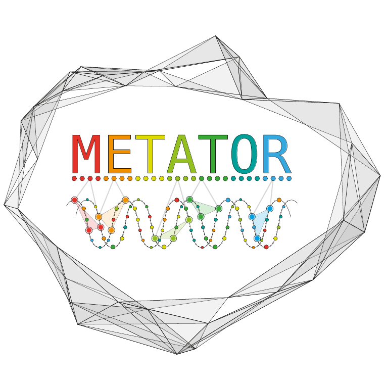

# Tuto_MetaTOR

Practical course to learn how to use MetaTOR piepline and Hi-C data for binning of metagenomic assemblies.


## Table of contents

* [MetaTOR](#MetaTOR)
* [Dataset](#Dataset)
* [Usage](#Usage)
* [Output files](#Output-files)
* [References](#References)
* [Contact](#Contact)

## MetaTOR

Metagenomic Tridimensional Organisation-based Reassembly

<p align="center">
  
</p>

A tutorial is available [here](docs/example/metator_tutorial.md) to explain how to use metaTOR. More advanced tutorials to analyze the output files are also available:

* [Anvio](https://merenlab.org/software/anvio/) manual curation of the contaminated bins. Available [here](docs/example/manual_curation_of_metator_MAGs.md).
* Visualization and scaffolding of the MAGs with the contactmap modules of MetaTOR. Available [here](docs/example/MAG_visualization_and_scaffolding.md).

Principle of MetaTOR pipeline:


## Dataset

The different data needed to perform the practical course can be found at the following path:

```sh
    ls -l /opt/metagenomics/tp3/
```

First, you will need to get the data (FastQ files, Assembly, Louvain algorithm…) and provide authorization for the Louvain executable.

In your workspace, copy/paste the following lines:

## Usage

```sh
    metator {network|partition|validation|pipeline} [parameters]
```

A metaTOR command takes the form `metator action --param1 arg1 --param2
arg2 #etc.`

There are three actions/steps in the metaTOR pipeline, which must be run in the
following order:

* `network` : Generate metaHiC contigs network from fastq reads or bam files and normalize it.
* `partition` : Perform the Louvain or Leiden community detection algorithm many times to bin contigs according to the metaHiC signal between contigs.

* `validation` : Use CheckM to validate the bins, then do a recursive decontamination step to remove contamination.

There are a number of other, optional, miscellaneous actions:

* `pipeline` : Run all three of the above actions sequentially or only some of them depending on the arguments given. This can take a while.
* `contactmap` : Generates a contact map from one bin from the final ouptut of metaTOR.

* `version` : display current version number.

* `help` : display help message.


## References

* [Metagenomic chromosome conformation capture (meta3C) unveils the diversity of chromosome organization in microorganisms](https://www.ncbi.nlm.nih.gov/pmc/articles/PMC4381813/), Martial Marbouty, Axel Cournac, Jean-François Flot, Hervé Marie-Nelly, Julien Mozziconacci, and Romain Koszul, eLife, 2014
* [Meta3C analysis of a mouse gut microbiome](https://www.biorxiv.org/content/early/2015/12/17/034793), Martial Marbouty, Lyam Baudry, Axel Cournac, Romain Koszul, 2015
* [Scaffolding bacterial genomes and probing host-virus interactions in gut microbiome by proximity ligation (chromosome capture) assay](https://www.ncbi.nlm.nih.gov/pmc/articles/PMC5315449/), Martial Marbouty, Lyam Baudry, Axel Cournac, and Romain Koszul, Science Advances, 2017

## Contact

### Authors

* amaury.bignaud@pasteur.fr
* lyam.baudry@pasteur.fr
* thfoutel@pasteur.fr
* martial.marbouty@pasteur.fr
* romain.koszul@pasteur.fr

### Research lab

[Spatial Regulation of Genomes](https://research.pasteur.fr/en/team/spatial-regulation-of-genomes/) (Institut Pasteur, Paris)
