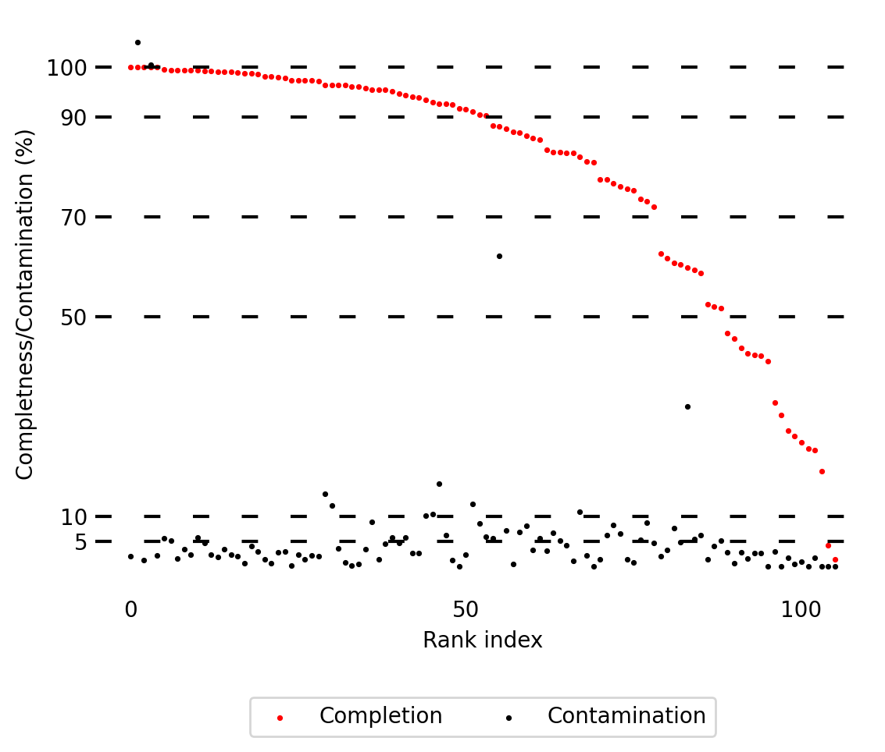
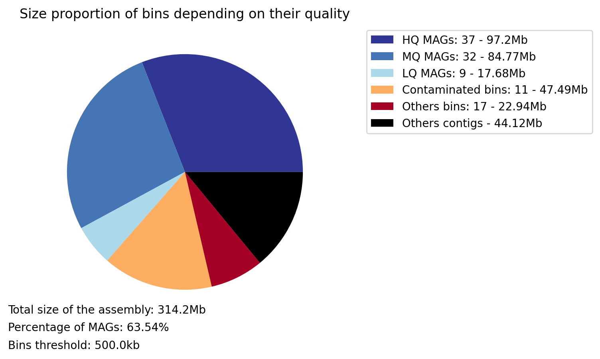
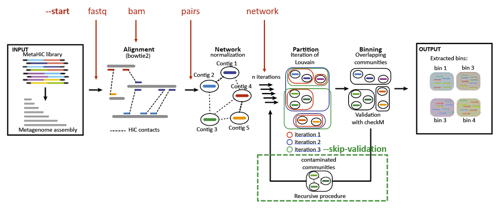
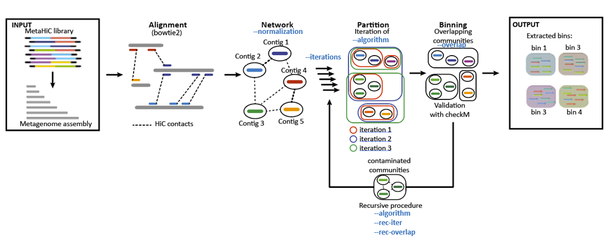

# Tutorial MetaTOR

In this notebook we will give an example on how to run MetaTOR in order to bin a small metganomics assembly into MAGs and explain the output of the pipeline.

## Table of contents

* [Input data](#Input-data)
* [A.Quick start](#A-Quick-start)
  * [1. Simplest command](#1-Simplest-command)
  * [2. Main output files](#2-Main-output-files)
* [B. A multiple modules pipeline](#B-A-multiple-modules-pipeline)
  * [1. Choose your starting point](#1-Choose-your-starting-point)
  * [2. Skip the validation module](#2-Skipthe-validation-module)
  * [3. Launch the modules separately](#3-Launch-the-modules-separately)
* [C. Advanced parameters](#C-Advanced-parameters)
  * [1. Digestion site](#1-Digestion-site)
  * [2. Binning parameters](#2-Binning-parameters)
* [D. Analysing the output](#D-Analysing-the-output)
* [References](#References)

## Input data

In this analysis, we will use a simple bacterial community ranging from stool samples from gnotobiotic mice (OligoMM12) 

Here the assembly has been made using ShotGun sequences (PE Illumina sequencing: 2x75bp, NextSeq500). Before building the assembly reads were filtered and trimmed using Cutadapt (v1.9.1). Here the assembly have been build using Megahit (v1.1.1.2) with default paramters.

the assembly can be found here : XXXX

in order to perform the binning based on 3D contact, we also need Hi-C dataset from the same sample.

FastQ Hi-C PE reads can be found here : XXXX

## A. Quick start

### 1. Simplest command

The simplest way to run metaTOR consist to run the full pipeline in one command with the default parameters:

```sh
metator pipeline -1 hic_reads_for.fastq.gz -2 hic_reads_rev.fastq.gz -a assembly.fa -o metator_folder --threads 16
```

```sh
INFO :: Minimum mapping quality: 30
INFO :: Enzyme: None
INFO :: Normalization: empirical_hit
INFO :: Partition algorithm: louvain
INFO :: Partition iterations: 100
INFO :: Overlapping parameter: 0.8
INFO :: Recursive partition iterations: 10
INFO :: Recursive overlapping parameter: 0.9
INFO :: Build index from the given fasta.
INFO :: Alignment of hic_for.fastq.gz:
[bam_sort_core] merging from 0 files and 16 in-memory blocks...
INFO :: Alignment of hic_rev.fastq.gz:
[bam_sort_core] merging from 0 files and 16 in-memory blocks...
INFO :: 44694905 forward reads aligned and 43649065 reverse reads aligned
INFO :: Merging the pairs:
INFO :: 38922357 pairs aligned.
INFO :: Information of alignment_0.pairs:
INFO :: 38922357 contacts in the library.
INFO :: 15243120 contacts inter-contigs in the library.
INFO :: 3D ratio : 0.39162890366582886

INFO :: Start iterations:
INFO :: Iteration in progress: 0
[...]
INFO :: Iteration in progress: 99
0.909622

INFO :: Detect core bins:
INFO :: 3467 core bins were found.
INFO :: Detect overlapping bins:
INFO :: 2131 overlapping bins were found.
INFO :: Extract bins:
INFO :: 61 bins have been extracted
INFO :: Total size of the extracted bins: 294.519Mb
INFO :: Start CheckM validation.
[...]
INFO :: 106 bins have been kept after the recursive iterations.
INFO :: Total size of the extracted bins: 270076511
INFO :: HQ MAGs: 37 Total Size: 97198990
INFO :: MQ MAGs: 32 Total Size: 84773041
INFO :: LQ MAGs: 9 Total Size: 17679996
INFO :: Contaminated potential MAGs: 11 Total Size: 47487326
INFO :: Others bins: 17 Total Size: 22937158
```

### 2. Main output files

The Software will give you the output in the metator folder, the full description of the output are available in the [README](https://github.com/koszullab/metaTOR/blob/master/README.md). The main output file is the final_bin directory with one fasta for each final bin. Moreover, in the bin summary file, see example below, you will find all informations known by the algorithm on the MAGs.

||lineage|completness|contamination|size|contigs|N50|longest_contig|GC|coding_density|taxonomy|HiC_Coverage|
|:-:|:-:|:-:|:-:|:-:|:-:|:-:|:-:|:-:|:-:|:-:|:-:|
|MetaTOR_1_3|f__Lachnospiraceae|99.52|5.57|4119470|469|40705|112608|46.37|88.85|k__Bacteria;p__Firmicutes;c__Clostridia;o__Clostridiales;f__Lachnospiraceae|2.14E+02|
|MetaTOR_1_4|o__Clostridiales|98.66|0.57|2859491|131|66245|143889|37.22|89.63|k__Bacteria;p__Firmicutes;c__Clostridia;o__Clostridiales;f__Lachnospiraceae_2;g__Lachnospira|6.04E+01|
|MetaTOR_2_0|o__Clostridiales|92.95|10.37|3471666|1456|4479|85988|47.64|88.54|k__Bacteria;p__Firmicutes;c__Clostridia;o__Clostridiales;f__Lachnospiraceae;g__Blautia|3.59E+01|

If give you some binning plot summary too:

|Bins completion/contamination distribution|Bins size quality distribution|
|:-:|:-:|
| | |

Another plot is the heatmap of the final bin network. It display the integrity inside a MAG and the noise between MAGs. All the bins of more than 500kb are represented. The order of the bins is the same as in the bin_summary.txt file. The binning size is 50kb.


## B. A multiple modules pipeline

### 1. Choose your starting point



One of the longest step is the alignemnent of the reads and the computation of the pairs file. Moreover, currently metaTOR use only bowtie2 to do the alignment with the --very-sensitive-local parameters to align the reads. You may already have a bam or a pairs file from another anlysis, or just want to use another aligner software, or different parameters of bowtie2. That's why it's possible to start at different stage with the `--start` parameter. There are four possible start:

* **fastq**: The default one with HiC forward and reverse reads fastq files (with this start it's possible to give the fasta or the bowtie2 index).

```sh
metator pipeline -1 hic_reads_for.fastq.gz -2 hic_reads_rev.fastq.gz -a assembly_bowtie2_index -S fastq
```

* **bam**: To avoid the alignment. Currently the only accecpted input is to seperate bam with the forward and reverse aligned separately. It could allow you to use different aligner or aligner parameters. **WARNING**: bam files need to be sorted on the reads ids in both files.

```sh
metator pipeline -1 for.bam -2 rev.bam -a assembly.fa -S bam
```

* **pair**: One pair file which follow the official specification of the [pairix format](https://github.com/4dn-dcic/pairix/blob/master/pairs_format_specification.md). This step allowed you to align simultaneously align both forward and reverse reads. However, you have to be careful as HiC pairs could be paires as unconcordant reads as they could be chimeric.

```sh
metator pipeline -1 alignment.pairs -a assembly.fa-S pairs
```

* **network**: A three column tsv network file with the first contig ID (1-based ids) the second contig ID and the normalised contact. This step allow you to use another custom normalization.

 ```sh
metator pipeline -n network.txt -a assembly.fa -S network
```

### 2. Skip the validation module

The recursif binning of metaTOR used checkM to check the contamination of the MAGs and apply a recursif clustering of the contigs in the contaminated MAGs. This step is a key step to clean the obtained MAG automatically. However, checkM needs a 40G memory usage. If you do not want to launch it you could skip the validation process and so the recursive binning of metaTOR:

```sh
metator pipeline -1 hic_reads_for.fastq.gz -2 hic_reads_rev.fastq.gz -a assembly_bowtie2_index -v
```

### 3. Launch the modules separately

It's also to launch the modules separately sequentially (the network module have the three first start stage option):

```sh
metator network -1 for.bam -2 rev.bam -a assembly.fa
metator partition -c contig_data_network.txt -n network.txt -a assembly.fa
metator validation -c contig_data_partition.txt -n network.txt -a assembly.fa -f overlapping_bin
```

## C. Advanced parameters

### 1. Binning parameters

A lot of parameters could be modify to optimize the binning at your own datasets. The default parameters aare the one which usually give the best results. However, depending on your datasets and if you want to do a manual cleaning step to decontaminate your MAGs, some parameters could be optimize.



#### a. Alignment

As previously explained, you cannot change directly the alignment parameters in MetaTOR yet. However, it's possible to make your own alignment and start with your bam or pairs files. You can also preprocess your reads before if it's necessary.

#### b. Network normalization

The normalization of metaHiC network is an important question. Currently, the default normalization consists in divided the number of inter-contig contacts by the geometric mean of the intra-contig contacts. It's showing the best results according to our benchmark. However, if you want to do your own normalization using models such as the one proposed by [HiCzin](https://github.com/dyxstat/HiCzin) [[5]](#References) which might yield better results you could do as follow:

```sh
# Build a network without normalization:
metator network -1 for.bam -2 rev.bam -a assembly.fa -n None
# Make your own network normalized (you just have to modify the third column of the network.txt file).
# Run the metaTOR pipleine at start stage network:
metator pipeline -n network_with_your_own_normalization.txt -a assembly.fa -S network
```

#### c. Partition parameters

For the partition you have 6 parameters that you can change. The default parameters have been choose as they usually work well on usual datasets. However, depending and your datasets you may want to change them:

* The partition algorithm: either Louvain or Leiden algorithm. Louvain [Default: Louvain]
  * The resolution parameter of Leiden quality function (Constant Potts Model). The bigger the parameter is the more stringent the clusterization is (more bins will be created).
* The number of iterations in the first partition. The more ierations you do the more bins you creates. Benchmark shows that 100 iterations are sufficient to extract all the bins. [Default: 100]
* The number of iterations in the recursive partition. [Default: 10]
* The overlapping parameter of the first partition. The overlapping parameters is the threshold percentage of iterations which bin two contigs in the same bin. A big overlapping parameter will reduce the contamination but bins might be uncomplete. [Default: 80]
* The overlapping parameter of the recursive partition.  [Default: 90]
  
## D. Analysing the output

Some others tutorials are available to analyze the output:

* [Anvio](https://merenlab.org/software/anvio/) manual curation of the contaminated bins. Available [here](manual_curation_of_metator_MAGs.md).
* Visualization and scaffolding of the MAGs with the contactmap modules of MetaTOR. Available [here](MAG_visualization_and_scaffolding.md).

## References

* [1] [MetaTOR: A Computational Pipeline to Recover High-Quality Metagenomic Bins From Mammalian Gut Proximity-Ligation (meta3C) Libraries.](https://www.frontiersin.org/articles/10.3389/fgene.2019.00753/full), L. Baudry, T. Foutel-Rodier, A. Thierry, R. Koszul, M. Marbouty. *Frontiers in genetics*, 2019.
* [2] [MEGAHIT: an ultra-fast single-node solution for large and complex metagenomics assembly via succinct de Bruijn graph](https://academic.oup.com/bioinformatics/article/31/10/1674/177884), D. Li, C. Liu, R. Luo, Kunihiko Sadakane, T. Lam, *Bioinformatics*, 2015.
* [3] [Using SPAdes De Novo Assembler](https://currentprotocols.onlinelibrary.wiley.com/doi/full/10.1002/cpbi.102), A. Prjibelski, D. Antipov, D. Meleshko, A. Lapidus, A. Korobeynikov, *Current Protocol in Bioinformatics*, 2020.
* [4] [Hicstuff: Simple library/pipeline to generate and handle Hi-C data.](http://doi.org/10.5281/zenodo.2620608), C. Matthey-Doret, L. Baudry, A. Bignaud, A. Cournac, R. Montagne, N. Guiglielmoni, T. Foutel Rodier and V. F. Scolari, *Zenodo*, 2020.
* [5] [HiCzin: Normalizing metagenomic Hi-C data and detecting spurious contacts using zero-inflated negative binomial regression](https://doi.org/10.1101/2021.03.01.433489) Y. Du, S. M. Laperriere, J. Fuhrman, F. Sun, *bioRxiv*, 2021.
